<!-- Page 1 -->
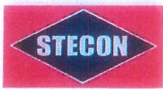

บริษัท ซีโน-ไทย เอ็นจิเนียริ่ง แอนด์ คอนสตรัคชั่น จำกัด (มหาชน)

SINO-THAI ENGINEERING AND CONSTRUCTION

PUBLIC COMPANY LIMITED

METHOD FOR REPAIRING TUNNEL SEGMENT

เอกสารควบคุม สำเนาที่ OAS/01
ใช้ได้เมื่อตราฯนี้เป็นสีแดงเท่านั้น

RECEIVED
09 OCT 2017
2/17

SEWERAGE TUNNEL BUNG NONG BON

TO CHAOPHRAYA RIVER PROJECT

STECON PRECAST CONCRETE COMPLEX

<!-- Page 2 -->
งานควบคุมการก่อสร้างโครงการก่อสร้างอุโมงค์ระบายน้ำจากบึงหนองบอนลงสู่แม่น้ำเจ้าพระยา

บริษัท ทีม คอนซัลติ้ง เอนจิเนียริ่ง แอนด์ แมเนจเมนท์ จำกัด

บริษัท ทีดับเบิ้ลยูไอ คอนซัลแตนส์ จำกัด

☎️ GPE บริษัท วิศวกรรมธรณีและฐานราก จำกัด

๑๒๐๓. ๑๒๗/๒๕๕

๑๓ กันยายน ๒๕๖๐

ที่สนน.๓๐/๒๕๕๔/Р๐๑๗๘๐/ВМА/๖๐๓๗๕

๑๓ กันยายน ๒๕๖๐

เรื่อง ผลการพิจารณาเอกสารขอนำส่งขั้นตอนการซ่อมแซมความเสียหายที่เกิดขึ้นกับชิ้นงาน (Method Statement for Repairing Tunnel Segment) (Rev. A)

เรียน ผู้อำนวยการโครงการ
โครงการก่อสร้างอุโมงค์ระบายน้ำจากบึงหนองบอนลงสู่แม่น้ำเจ้าพระยา

อ้างถึง ๑. สัญญาเลขที่ สนน. ๑๘๔/๒๕๕๘ ลงวันที่ ๓๐ กันยายน ๑๕๕๘
๒. สัญญาเลขที่ สนน. ๓๐/๒๕๕๙ ลงวันที่ ๑๑ มกราคม ๒๕๕๙
๓. หนังสือของผู้รับจ้างเลขที่ NB.๒๕๖๐/๓๑๐ ลงวันที่ ๒๔ สิงหาคม ๒๕๖๐

ตามที่ สำนักการระบายน้ำ กรุงเทพมหานคร ได้ว่าจ้างกิจการร่วมค้า เอสที- เอสจี เป็นผู้รับจ้างโครงการก่อสร้างอุโมงค์ระบายน้ำจากบึงหนองบอนลงสู่แม่น้ำเจ้าพระยา รายละเอียดตามสัญญาที่อ้างถึง ๑. และว่าจ้างบริษัท ทีม คอนซัลติ้ง เอนจิเนียริ่ง แอนด์ แมเนจเมนท์ จำกัด บริษัท ทีดับเบิ้ลยูไอ คอนซัลแตนส์ จำกัด และบริษัท วิศวกรรมธรณีและฐานราก จำกัด เป็นที่ปรึกษาควบคุมการก่อสร้างอุโมงค์ระบายน้ำจากบึงหนองบอนลงสู่แม่น้ำเจ้าพระยา รายละเอียดตามสัญญาที่อ้างถึง ๒. และ ตามที่อ้างถึง ๓. ผู้รับจ้างได้ส่งเอกสารขอนำส่งขั้นตอนการซ่อมแซมความเสียหายที่เกิดขึ้นกับชิ้นงาน (Method Statement for Repairing Tunnel Segment) (Rev. A) ให้สำนักงานโครงการพิจารณาและสำเนาให้กลุ่มบริษัทที่ปรึกษาตรวจสอบนั้น

กลุ่มบริษัทที่ปรึกษาได้พิจารณาเอกสารขอนำส่งขั้นตอนการซ่อมแซมความเสียหายที่เกิดขึ้นกับชิ้นงาน (Method Statement for Repairing Tunnel Segment) (Rev. A) แล้วมีความเห็นว่าสามารถอนุมัติขั้นตอนวิธีการ และคุณสมบัติของวัสดุตามที่ผู้รับจ้างเสนอได้ ทั้งนี้การวินิจฉัยว่าจะซ่อมขึ้นส่วนที่เสียหายด้วยวิธีใดจะต้องได้รับความเห็นชอบจากผู้ควบคุมงานก่อนจึงจะสามารถดำเนินการซ่อมแซมส่วนที่เสียหายได้

จึงเรียนมาเพื่อโปรดพิจารณา

ขอแสดงความนับถือ
_________________________
(นายรัชตสรรค์ วัฒนโกร)
วิศวกรโครงการ
กลุ่มบริษัทที่ปรึกษาควบคุมงาน

รว/ณพ

NWP/WE/LT๖๐๐๔/Р๐๑๗๘๐/LT๓๗๕

<!-- Page 3 -->
ที่ อนบ. 6/๒๕๖๐

สำนักงานโครงการฯ
๑๒๓ ถนนมิตรไมตรี เขตดินแดง กทม. ๑๐๔๐๐

๒๕  กันยายน ๒๕๖๐

เรื่อง ผลการพิจารณาเอกสารขอนำส่งขั้นตอนการซ่อมแซมความเสียหายที่เกิดขึ้นกับชิ้นงาน (Method Statement for Repairing Tunnel Segment) (Rev.A)

เรียน ผู้แทนกิจการร่วมค้า เอสที – เอสจี

อ้างถึง ๑. สัญญาเลขที่ สนน. ๑๘๔/๒๕๕๘ ลงวันที่ ๓๐ กันยายน ๒๕๕๘
๒. สัญญาแก้ไขเพิ่มเติม (ครั้งที่ ๑) ลงวันที่ ๑ มีนาคม ๒๕๖๐
๓. หนังสือกิจการร่วมค้า เอสที – เอสจี ที่ N8. ๒๕๖๐/๓๑๐ ลงวันที่ ๒๕ สิงหาคม ๒๕๖๐

สิ่งที่ส่งมาด้วย สำเนาหนังสือกลุ่มบริษัทที่ปรึกษาฯ ที่ สนน.๓๐/๒๕๕๙/POA0140/BMA/500012
ลงวันที่ ๑๓ กันยายน ๒๕๖๐

ตามหนังสือที่อ้างถึง ๑ - ๒ กรุงเทพมหานคร โดยสำนักการระบายน้ำได้จ้างเหมากิจการร่วมค้า เอสที – เอสจี ดำเนินการโครงการก่อสร้างอุโมงค์ระบายน้ำจากบึงหนองบอนลงสู่แม่น้ำเจ้าพระยา และหนังสือ ที่อ้างถึง ๓ กิจการร่วมค้า เอสที-เอสจี ขอนำส่งขั้นตอนการซ่อมแซมความเสียหายที่เกิดขึ้นกับชิ้นงาน (Method Statement for Repairing Tunnel Segment) (Rev.A) และกลุ่มบริษัทที่ปรึกษาฯ ได้พิจารณาเอกสารดังกล่าวแล้ว ความละเอียดแจ้งแล้ว นั้น

สำนักงานโครงการฯ พิจารณาขั้นตอนการซ่อมแซมความเสียหายที่เกิดขึ้นกับชิ้นงาน (Method Statement for Repairing Tunnel Segment) (Rev.A) แล้ว ไม่ขัดข้องอนุมัติให้กิจการร่วมค้า เอสที – เอสจี ดำเนินการขั้นตอน วิธีการ และคุณสมบัติของวัสดุตามที่เสนอ ทั้งนี้ การวินิจฉัยว่าจะซ่อมชิ้นส่วนที่เสียหาย ด้วยวิธีใดจะต้องได้รับความเห็นชอบจากผู้ควบคุมงานก่อนจึงจะสามารถดำเนินการซ่อมแซมส่วนที่เสียหายได้ ตามความเห็นของกลุ่มบริษัทที่ปรึกษาฯ รายละเอียดตามสิ่งที่ส่งมาด้วย ดังนี้

จึงเรียนมาเพื่อทราบและดำเนินการต่อไป

ขอแสดงความนับถือ

(นายสัญญภักษณ์ ก้องกิจการ)
ผู้ช่วยผู้จัดการโครงการ
รักษาการในตำแหน่งผู้จัดการโครงการ

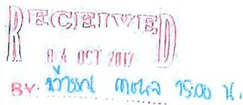

สำนักงานโครงการ
โทร. ๐ ๒๒๔๖ ๐๓๑๔
โทรสาร ๐ ๒๒๔๖ ๐๓๑๔

<!-- Page 4 -->
1

บริษัท พิษะ-โภส เล่นดิทันรุ่ง กระดก สะพอกไฟฟ้า จำกัด (สหกรณ์)
5100-71144 51100111111111111111111111111111111111111111111111111111

# CONTENT

[tbl-0.html](tables/tbl-0.html.html)

<!-- Page 5 -->
บริษัท ฟิน-โคว-เนีย-จีเนีย-โค-เนีย-สยามหาโนล่า จำกัด (ยกเวลา)
ฉบับ: THAI ENGINEERING &amp; CONSTRUCTION POWER COMPANY LIMITED

TB-RP-01

# GUIDELINE FOR REPAIR

PROJECT : SEWERAGE TUNNEL BUNG NONG BON TO CHAOPHRAYA RIVER

<!-- Page 6 -->
หน้าที่ 356

หน้าที่ 356 ให้มี สิ่งที่มีอยู่ 356

Project : SÈWERAGE TUNNEL BUNG NONG BON

TO CHAOPHRAYA RIVER

# การซ่อมแซมความเสียหายที่เกิดขึ้นกับชิ้นงาน

## ขอบเขตของงาน (Scope of Work)

วิธีการซ่อมแซมชิ้นส่วนอุโมงค์จัดทำขึ้น เพื่อใช้สำหรับการซ่อมผิวคอนกรีตของชิ้นส่วนผนังอุโมงค์ สำหรับโครงการก่อสร้างอุโมงค์ระบายน้ำจากบึงหนองบอนลงสู่แม่น้ำเจ้าพระยาซึ่งลักษณะความเสียหายหรือข้อบกพร่องอาจเกิดขึ้นจากกระบวนการผลิต การขนส่งและเคลื่อนย้าย หรือการเก็บรักษา ที่โรงงานผลิตชิ้นส่วนอุโมงค์ โดยที่ความเสียหายนี้ไม่มีผลกระทบต่อโครงสร้างหลักของชิ้นส่วนผนังอุโมงค์ตามที่ออกแบบไว้ ทั้งนี้ทางฝ่ายผลิตและควบคุมคุณภาพจะทำการบันทึกข้อมูลไว้ หากมีความเสียหายมากเกินข้อกำหนด จะต้องทำการตรวจสอบและทบทวนเพื่อหาข้อบกพร่อง ดังนี้

1.) ความเสียหายจากการผลิต ไม่เกิน 5% ของจำนวน Rings ที่ผลิตได้
2.) ความเสียหายจากการขนส่งและการขนย้าย ไม่เกิน 2% ของจำนวน Rings ของการขนส่ง

ความเสียหายที่เกิดขึ้นกับชิ้นงานแบ่งได้เป็น 4 ลักษณะได้แก่

1.) รอยร้าว (Crack)
2.) แตกปั้นที่ขอบ (Spalling Edge)
3.) แตกปั้นบริเวณ Gasket (Spalling Recesses)
4.) รูฟองอากาศ (Voids or Blowholes)

Document No. TB-RP-01

Release/Amendment Issue 2 Date : 20/6/2017

Page No. 1 of 7

<!-- Page 7 -->
11111111111111111111111111111111111111111111111111111111111111111111111111111111111111111111111111

Project: SEWERAGE TUNNEL BUNG NONG BON

TO CHAOPHRAYA RIVER

$\odot$  รอยรั่ว (Crack)

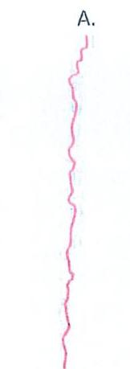
a.Hard Crack

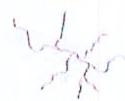
b.Shrinkage Crack

Table1 – Guideline for Crack Repair

[tbl-1.html](tables/tbl-1.html.html)

Document No.

TB-RP-01

Release/Amendment

Issue 2 Date: 20/6/2017

Page No.

2 of 7

<!-- Page 8 -->
2110084

บริษัท จิโม-ไลท เล็กซิเมอร์ แมทท์ คอมพิวเตอร์ จำกัด (มหาชน)

WHO-THAI ENGINEERING &amp; CONSTRUCTION PUBLIC COMPANY LIMITED

Project : SEWERAGE TUNNEL BUNG NONG BON

TO CHAOPHRAYA RIVER

- แตกข้อเท็จจริง (Spalling Edge)

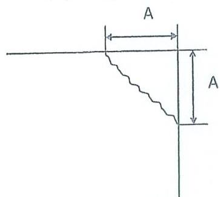
a. Sharp Edge

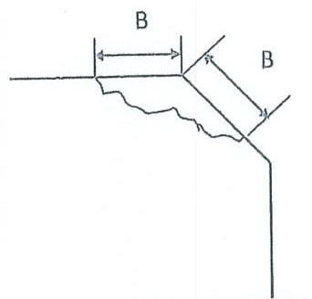
b. Chamfered Edge

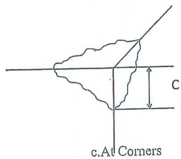
c. As Corners

Table2 – Guideline for Spalling Edge Repair

[tbl-2.html](tables/tbl-2.html.html)
[tbl-3.html](tables/tbl-3.html.html)

<!-- Page 9 -->
STF000

บริษัท วัฒน ไทย เล่นที่เห็นว่า แผนที่ พลุมเลส ให้พ้น จำกัด (พนานนท์)

5

Project : SEWERAGE TUNNEL BUNG NONG BON

TO CHAOPHRAYA RIVER

- แตกบั้นบริเวณ Gasket (Spalling Recesses)

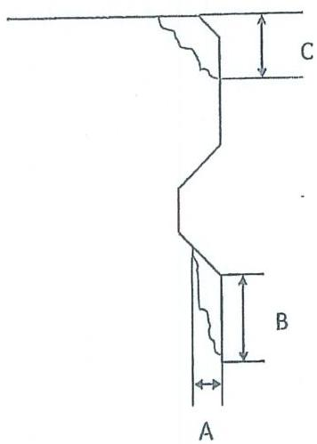

Table3 -- Guideline for Recesses Repair

[tbl-4.html](tables/tbl-4.html.html)

Document No.

TB-RP-01

Release/Amendment

Issue 2 Date: 20/6/2017

Page No.

4 of 7

<!-- Page 10 -->
STIHUN

บริษัท จับ-โรง เงินพิพิธภัณฑ์ และโรงแรมจัดห้าซื้อ จ.ย.ย. (สหกรณ์)

SIHU-THAI ENGINEERING &amp; CONSTRUCTION PUBLIC COMPANY LIMITED

Project : SEWERAGE TUNNEL BUNG NONG BON

TO CHAOPHIRAYA RIVER

- รูฟองอากาศ (Voids or Blowholes)

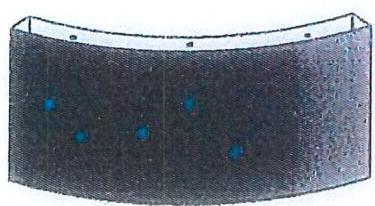
A.Outside Surface

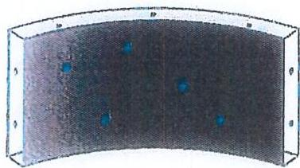
B.Inside Surface

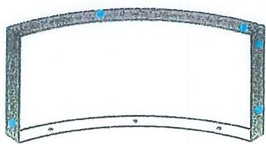
C.Gasket Surface

Table4 – Guideline for Voids or Blowholes Repair

[tbl-5.html](tables/tbl-5.html.html)
[tbl-6.html](tables/tbl-6.html.html)

<!-- Page 11 -->
2

1

5

Project : SEWERAGE TUNNEL BUNG NONG BON

TO CHAOPHRAYA RIVER

# ตารางแสดงวัสดุที่ใช้ซ่อมแซมความเสียหายประเภทต่างๆ

[tbl-7.html](tables/tbl-7.html.html)

Document No. TB-RP-01

Release/Amendment Issue 2 Date : 20/6/2017

Page No. 6 of 7

<!-- Page 12 -->
STEOO

แจ้งให้ ให้ ใคร เล่นที่เกี่ยวข้อง และที่ สอบรองให้เห็น จำกัด (สหกรณ์)

STEOO THE PROMOTION &amp; CONSTRUCTION FORM COMPANY LIMITED

Project : SEWERAGE TUNNEL BUNG NONG BON

TO CHAOPHRAYA RIVER

# รายการวัสดุซ่อม

[tbl-8.html](tables/tbl-8.html.html)
[tbl-9.html](tables/tbl-9.html.html)

<!-- Page 13 -->
RPP-TN-01

# REPAIR WITH CEMENTITIOUS MORTAR

PROJECT : SEWERAGE TUNNEL BUNG NONG BON TO CHAOPHRAYA RIVER

9

<!-- Page 14 -->
LYDRO

บริษัท ซีโน-ไลน์ เล็กซิเนียริ่ง แบบส่ง คอนเทนเนียริ่ง จำกัด (สหกรณ์)

World Trust Concentration &amp; Co. (WCC) and Public Co. (PC) Limited

Project : SEWERAGE TUNNEL BUNG NONG BON

TO CHAOPHRAYA RIVER

# RP-TN-01 (Crack Repair With Cementitious Mortar)

วิธีการ Repair With Cementitious Mortar ใช้ในการซ่อมแซมรอยร้าวทั่วไปที่มีความกว้างมากกว่า 0.1mm. แต่ไม่ถึง 0.3mm. และความลึกของรอยร้าวมากกว่า 15mm. รวมทั้งใช้ในการซ่อมแซมรอยร้าวแบบ Shrinkage Crack ที่มีความกว้าง 0.3-0.5mm. โดยการวัดความกว้างของรอยร้าวต้องใช้แผ่น Crack Width Indicator ในการวัด

คงซีเมนต์ที่ใช้ในการซ่อมแซมมีคุณสมบัติในการต้านทานการสึกหรอ สามารถยึดเกาะกับผิวคอนกรีตเดิมได้ดี และมีสีที่ใกล้เคียงกับสีคอนกรีต

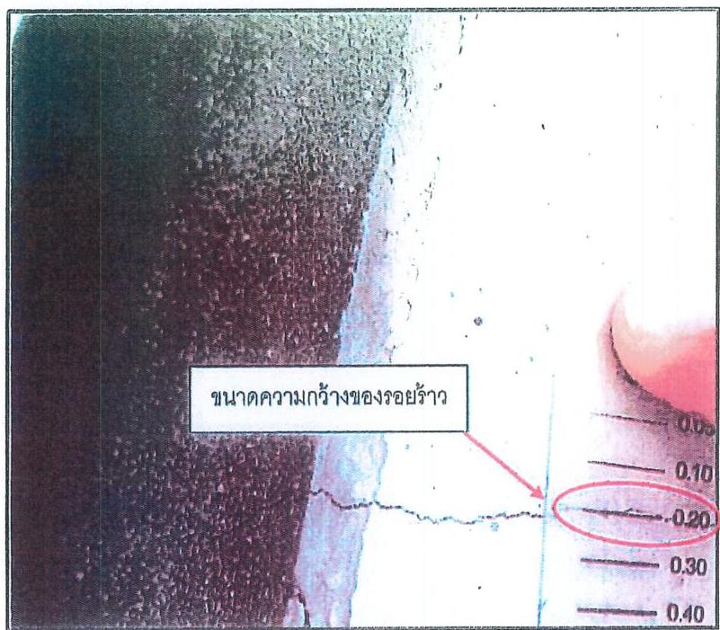
รูปที่ 1 แสดงการวัดความกว้างของรอยร้าวโดยใช้ Crack Width Indicator

Document No.
RP-TN-01

Release/Amendment
Issue 2
Date : 20/6/2017

Page No.
1 of 5

<!-- Page 15 -->
671000

บริษัท ซีโน-ไทย เล็กพิมพ์ทุก แผนที่ คอมพิวเตอร์ คำบัตร (จัดการ)

SINO-THAI ENGINEERING &amp; CONSTRUCTION PUBLIC COMPANY LIMITED

Project : SEWERAGE TUNNEL BUNG NONG BON

TO CHAOPHRAYA RIVER

1. อุปกรณ์ที่ใช้ในการซ่อมแซม

1.1 เครื่องเป่าลม
1.2 เกรียง
1.3 ฟองน้ำหรือลูกกลิ้ง
1.4 กระดาษทราย
1.5 ภาชนะใส่วัสดุซ่อม

2. วัสดุที่ใช้ในการซ่อมแซม

2.1 ปูนฉาบซ่อมที่ใช้ในโครงการดังนี้

[tbl-10.html](tables/tbl-10.html.html)

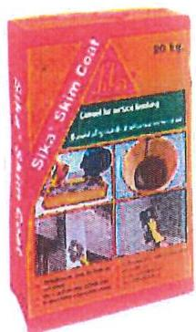

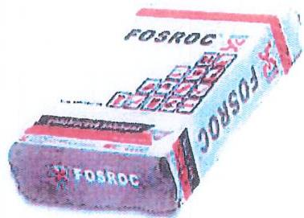

Document No.

RP-TN-01

Release/Amendment

Issue 2 Date: 20/6/2017

Page No.

2 of 5

<!-- Page 16 -->
หน้าที่ 96
หน้าที่ 96 หน้าที่ 100
Project : SEWERAGE TUNNEL BUNG NONG BON
TO CHAOPHRAYA RIVER

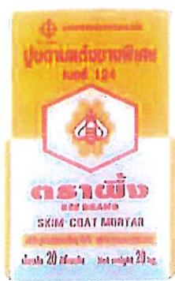

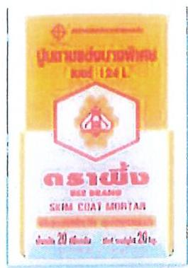

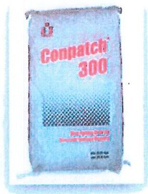

รูปที่ 2 แสดงวัสดุฉาบที่ใช้ในการซ่อมแซมผิว

3. ขั้นตอนในการซ่อมแซม

3.1 ใช้เครื่องเป่าลมเป่าทำความสะอาดผิวคอนกรีตบริเวณที่เกิดรอยร้าว ตรวจสอบความสะอาดก่อนการซ่อมแซม

3.2 ผสมปูนฉาบซ่อมตามอัตราส่วนข้างต้น แล้วฉาบลงบนผิวคอนกรีตบริเวณที่เกิดรอยร้าว โดยเริ่มจากปลายด้านใดด้านหนึ่งของรอยร้าว

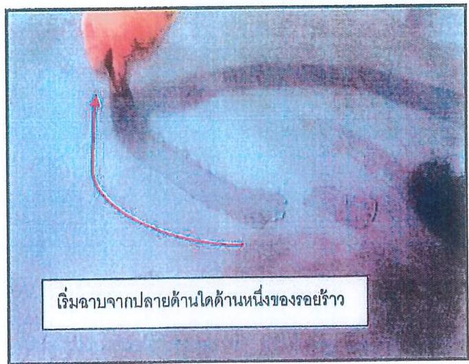

รูปที่ 3 แสดงการฉาบแต่งรอยร้าว

[tbl-11.html](tables/tbl-11.html.html)

<!-- Page 17 -->
บริษัท วิธีการโดย เมื่อจับภูมิใจ และแต่งตลาดวิธีการจ้าง (สหกรณ์)
VINH-THAI UNIVERSITY &amp; COUNTRIES GOVERNMENTAL UNIVERSITY
Project : SEWERAGE TUNNEL BUNG NONG BON
TO CHAOPHRAYA RIVER

## 3.3 หลังจากปูนฉาบแห้งแล้ว ใช้กระดาษทรายขัดบริเวณที่ฉาบให้มีผิวเรียบเสมอกับผิวคอนกรีตบริเวณอื่น

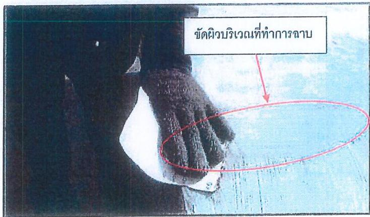

รูปที่ 4 แสดงการขัดผิวปูนฉาบ

## 3.4 ผสมปูนฉาบให้เหลว ใช้ฟองน้ำหรือลูกกลิ้งชุบแล้วลูบที่ผิวคอนกรีต เพื่อให้ผิวคอนกรีตมีสีสม่ำเสมอ

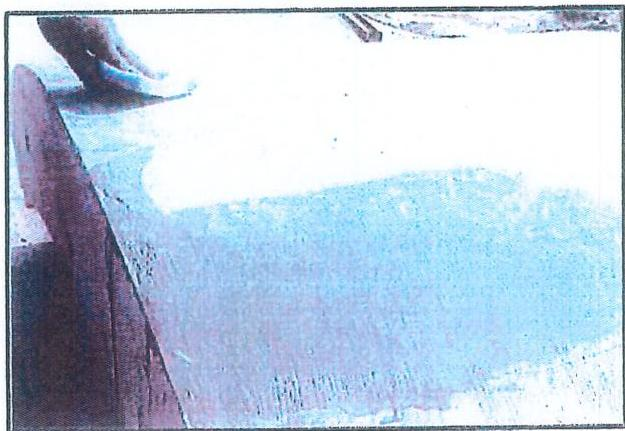

รูปที่ 5 แสดงการลูบผิวคอนกรีตด้วยปูนฉาบเหลว

[tbl-12.html](tables/tbl-12.html.html)

<!-- Page 18 -->
LITESDA

บริษัท ซีริบ-ไฮซ เล็ปท์:มือวี๋ง แผนด์ คอนสตว์ทชั่น จำกัด (ทศวรรษ)

SHIG-THAI ENGINEERING &amp; CONSTRUCTION PUBLIC COMPANY LIMITED

Project : SEWERAGE TUNNEL BUNG NONG BON

TO CHAOPHRAYA RIVER

## 3.5 หลังจากน้ำปูนแห้งแล้วตรวจสอบรอยร้าวอีกครั้งโดยละเอียด

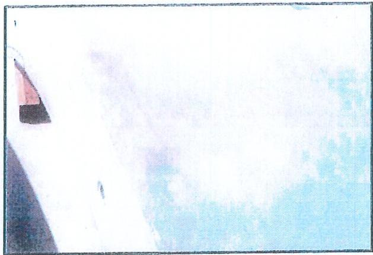

รูปที่ 6 แสดงขึ้นงานที่ซ่อมแซมเสร็จแล้ว

Document No.

RP-TN-01

Release/Amendment

Issue 2 Date : 20/6/2017

Page No.

5 of 5

14

<!-- Page 19 -->
RPP-TN-02

# REPAIR WITH EPOXY RESIN

PROJECT : SEWERAGE TUNNEL BUNG NONG BON TO CHAOPHRAYA RIVER

15

<!-- Page 20 -->
511000

บริษัท พิม.-ไทย เอ็นจิเนียร์จ แอปตี้ สะบาดสวีทชั่น จำกัด (มหาชน)

5000 THAI UNGURTING &amp; CONSTRUCTION PUBLIC COMPANY LIMITED

Project : SEWERAGE TUNNEL BUNG NONG BON

TO CHAOPHRAYA RIVER

# RP-TN-02 (Crack Repair With Epoxy Resin)

วิธีการ Repair With Epoxy Resin ใช้ในการซ่อมแซมรอยรั่วทั่วไปที่มีความกว้างตั้งแต่ 0.3mm. ถึง 0.5mm. และมีความลึกมากกว่า 15mm. แต่ไม่ถึงเหล็กเสริม โดยวิธีการนี้จะใช้วัสดุอีฟอกซิไรซีน ซึ่งมีลักษณะเป็นของเหลวที่มีความหนืดดำ สามารถซึมผ่านช่องรอยรั่วที่มีขนาดเล็กได้ดี มีกำลังอัด และแรงยึดเกาะที่สูงกว่าคอนกรีต รวมถึงมีคุณสมบัติด้านทานการซึมผ่านของน้ำและไม่มีการหดตัว

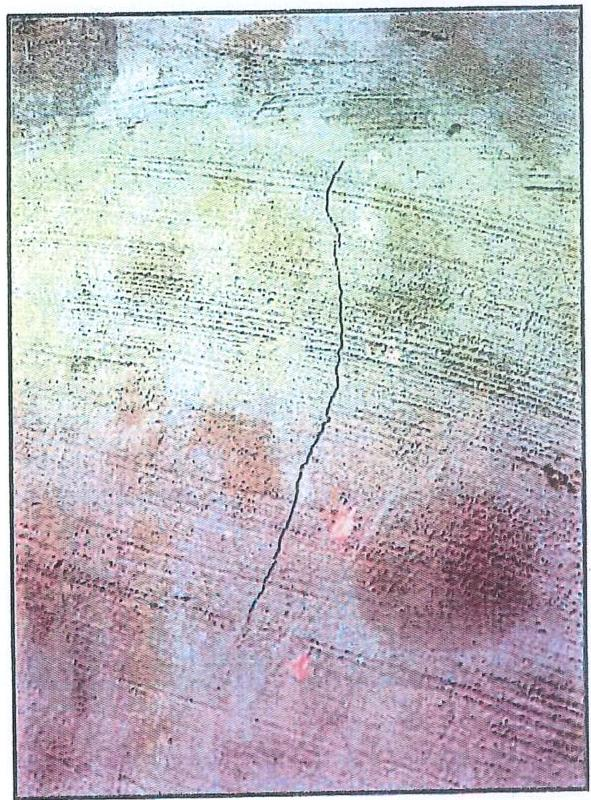

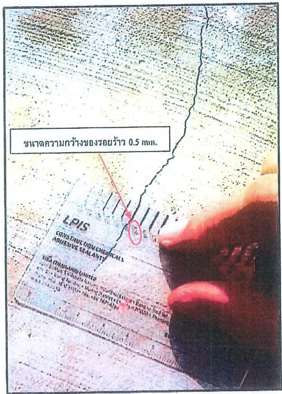

รูปที่ 1 แสดงการวัดความกว้างของรอยรั่วโดยใช้ Crack Width Indicator

Document No.

RP-TN-02

Release/Amendment

Issue 2 Date : 20/6/2017

Page No.

1 of 8

16

<!-- Page 21 -->
1704

บริษัท จิโน-ไลน์ เล็บที่มีนวั่ง และเล็งทะเลอิเล็ก จำกัด (สหกรณ์)

5000 THAI FOURTH AVE. COMUNICATED POWER COMPANY LIMITED

Project : SEWERAGE TUNNEL BUNG NONG BON

TO CHAOPHRAYA RIVER

# 1. อุปกรณ์ที่ใช้ในการซ่อมแซม

1.1 เครื่องเป่าลม
1.2 เกรียง
1.3 ฟองน้ำหรือลูกกลิ้ง
1.4 เครื่องตัดและใบตัดคอนกรีต
1.5 กระดาษทราย
1.6 ภาชนะใส่วัสดุซ่อม

# 2. วัสดุที่ใช้ในการซ่อมแซม

2.1 อิพิอกซี่สำหรับซ่อมแซมรอยร้าวที่เสนอขออนุมัติใช้ดังนี้

[tbl-13.html](tables/tbl-13.html.html)

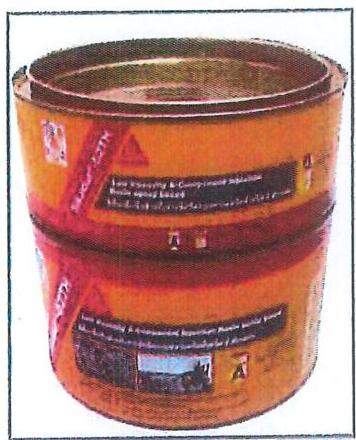

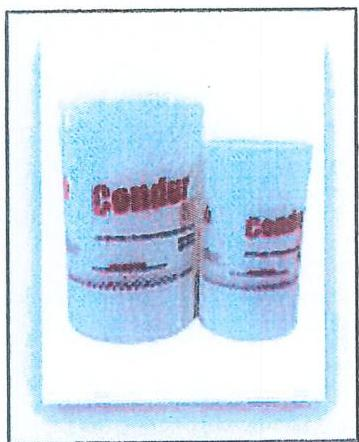

รูปที่ 2 แสดงวัสดุอิทธิอกรีตที่ใช้ในการซ่อมแซมรอยร้าว

Document No.
RP-TN-02

Release/Amendment
Issue 2 Date : 20/6/2017

Page No.
2 of 8

<!-- Page 22 -->
T100D

บริษัท ซีด-ไทย เล่มที่เกี่ยวข้องกับอุตสาหกรรมต่างๆ

Project : SEWERAGE TUNNEL BUNG NONG BON

TO CHAOPHRAYA RIVER

## 2.2 ปูนฉาบซ่อมที่ใช้ในโครงการดังนี้

[tbl-14.html](tables/tbl-14.html.html)

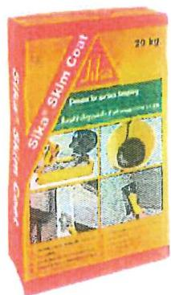

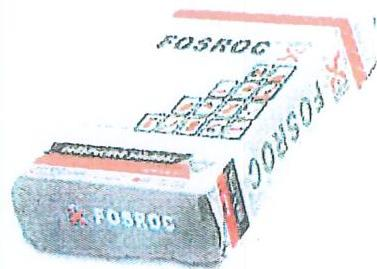

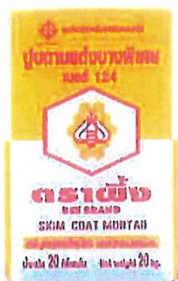

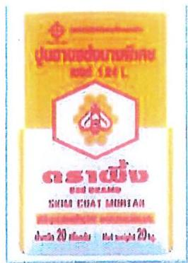

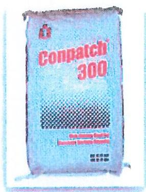

รูปที่ 3 แสดงวัสดุฉาบที่ใช้ในการซ่อมแซมตัว

Document No.

RP-TN-02

Release/Amendment

Issue 2 Date : 20/6/2017

Page No.

3 of 8

<!-- Page 23 -->
บริษัท จีโน ไดร้ ปรับใช้ในการจัดทำและการจัดทำ จำกัด (สหกรณ์)
WHO THE FINGINTHING &amp; COUNTING FROM PUBLIC COMPANY LIMITED
Project : SEWERAGE TUNNEL BUNG NONG BON
TO CHAOPHRAYA RIVER

## 3. ขั้นตอนในการซ่อมแซม

### 3.1 ใช้เครื่องตัดคอนกรีตเซาะร่องตามแนวรอยรั่ว โดยให้ร่องมีลักษณะคล้ายตัว V ให้บริเวณปากร่องมีความกว้าง 3-5 mm. โดยประมาณ

รูปที่ 4 แสดงการเซาะร่องตามแนวรอยรั่ว

### 3.2 ทำความสะอาดผิวคอนกรีตแล้วใช้เครื่องเป่าลมเป่าผิวคอนกรีต บริเวณที่จะทำการซ่อมแซมจะต้องปราศจากฝุ่น เศษวัสดุ หรือคราบน้ำมัน

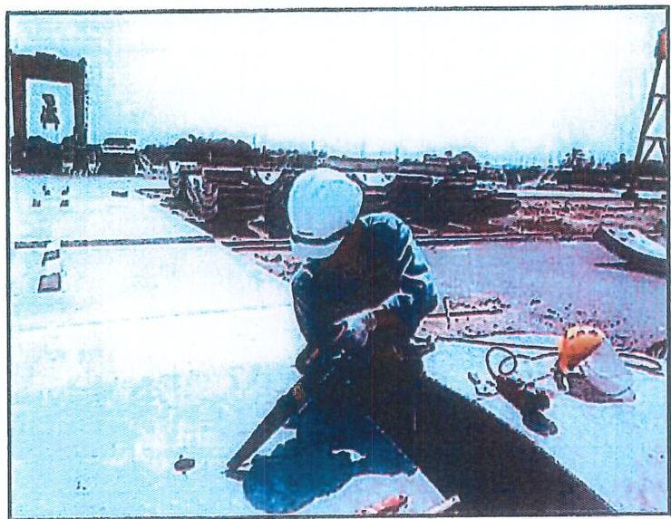
รูปที่ 5 แสดงการทำความสะอาดรอยรั่วเพื่อเตรียมซ่อมแซม

Document No.
RP-TN-02
Release/Amendment
Issue 2 Date : 20/6/2017
Page No.
4 of 8
19

<!-- Page 24 -->
VITRO

บริษัท อัตราโดย เล็บที่เพิ่มขึ้น ตอนนี้ ตอนนี้จะใช้ชั้น จำกัด (สหกรณ์)

VOID THEY PROBABLY ARE A CONFIRMATION FOR IT COMPANY LIMITED

Project : SEWERAGE TUNNEL BUNG NONG BON

TO CHAOPHRAYA RIVER

3.3 ทำแนวตั้งแนวทางกับแนวรอยข้าวทั้ง 2 ทั้ง ห่างจากรอยข้าวทั้งละ 5mm. โดยประมาณ เพื่อไม่ให้วัสดุซ่อมโคนผิวคอนกรีตส่วนอื่น

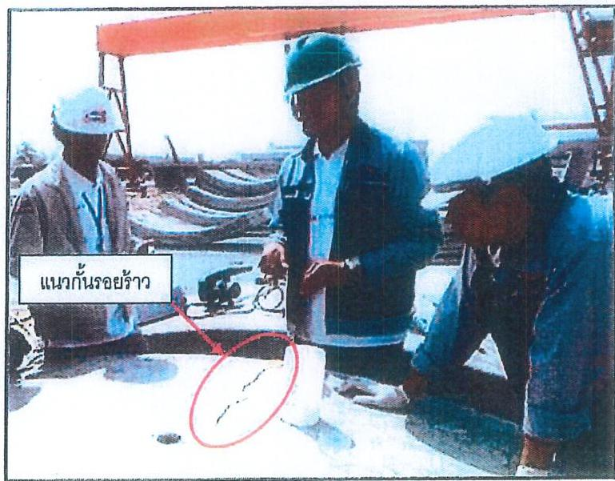
รูปที่ 6 แสดงการทำแนวตั้งรอยข้าว

3.4 หยอดวัสดุซ่อมอิพ็อกซี่เรซิ่นที่ผสมตามอัตราส่วนข้างต้นลงในร่องตามแนวรอยข้าว โดยเริ่มจากริมทั้งใดทั้งหนึ่งของรอยข้าว หลังจากหยอดวัสดุซ่อมลงไปแล้วให้สังเกตุว่า วัสดุซ่อมมีระดับลดลงหรือไม่ หากพบว่ามีระดับลดลงจะต้องหยอดเพิ่มจนกว่าจะแน่ใจว่า วัสดุซ่อมเต็มรอยข้าวแล้ว

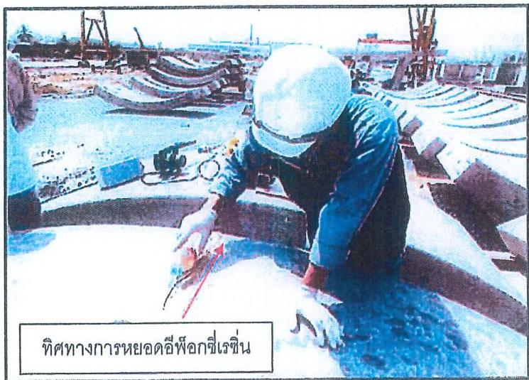
รูปที่ 7 แสดงการหยอดอิพ็อกซี่เรซิ่นลงในร่อง

Document No.

RP-TN-02

Release/Amendment

Issue 2 Date : 20/6/2017

Page No.

5 of 8

<!-- Page 25 -->
STVOCH

บริษัท ซีน-ไทย เข้มข้นข้าว แกงเล็ก แกงสัตว์ รากี (เกรด)

Project : SEWERAGE TUNNEL BUNG NONG BON

TO CHAOPHRAYA RIVER

3.5 หลังจากวัสดุซ่อมเซลตั๋วแล้วให้เอาแนวกั้นออก แล้วทำความสะอาดผิวคอนกรีตบริเวณ นั้นเพื่อเตรียมการตกแต่งผิว

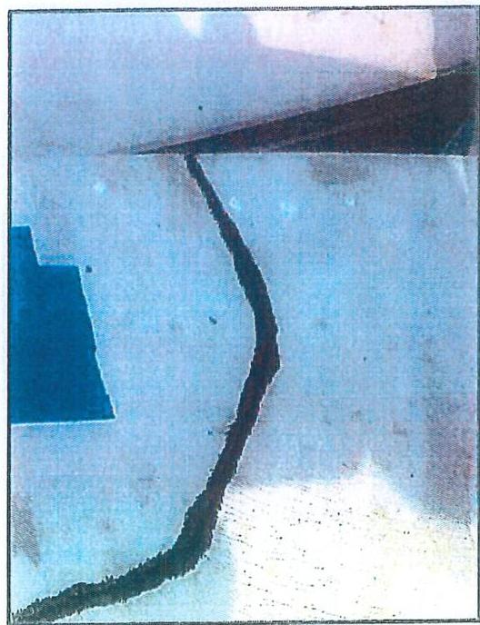

รูปที่ 8 แสดงรอยร้าวที่หยอดวัสดุซ่อมแล้ว

3.6 ผสมปูนฉาบซ่อมตามอัตราส่วนข้างต้น ฉาบทับรอยร้าวที่ได้รับการซ่อมแซมแล้ว

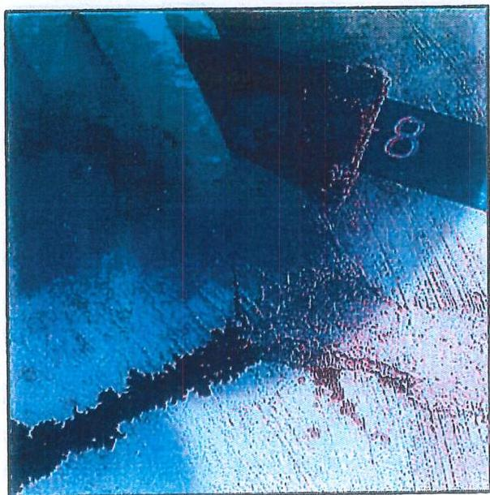

รูปที่ 9 แสดงการฉาบทับรอยร้าว

[tbl-15.html](tables/tbl-15.html.html)

<!-- Page 26 -->
บริษัท จีน-ไทย เข้มจีนั่นจำ ตอนที่ ตอนฉะเหิน ม. จ.จ. (มหาชน)
SINO-THAI ENGLISHING &amp; CONSTRUCTION POWER COMPANY LIMITED
Project : SEWERAGE TUNNEL BUNG NONG BON
TO CHAOPHRAYA RIVER

3.7 หลังจากปูนฉาบแห้ง ใช้กระดาษทรายขัดบริเวณที่ได้ทำการฉาบให้มีผิวเรียบเสมอกับผิวคอนกรีตบริเวณอื่น

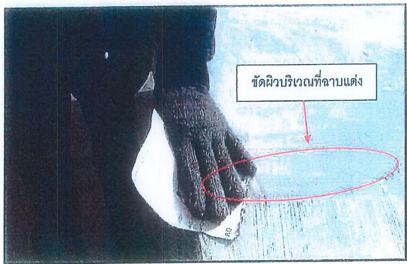
รูปที่ 10 แสดงการขัดผิวคอนกรีตหลังจากปูนฉาบแห้งแล้ว

3.8 ผสมปูนฉาบซ่อมให้เหลว ใช้ฟองน้ำหรือลูกกลิ้งชุบแล้วลูบที่ผิวคอนกรีต เพื่อให้ผิวคอนกรีตมีสีสม่ำเสมอ

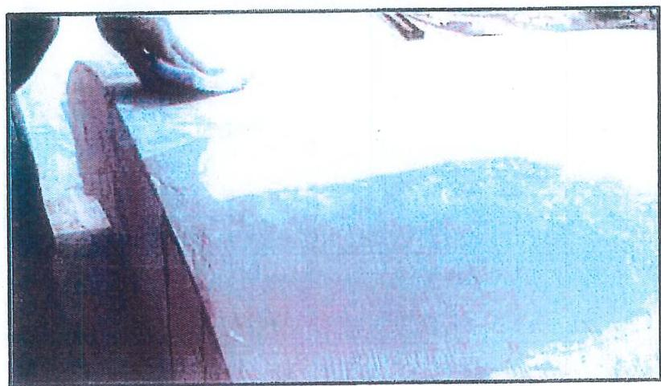
รูปที่ 11 แสดงการดูดผิวคอนกรีตด้วยน้ำปูนเพื่อให้มีสีผิวสม่ำเสมอ

Document No.
RP-TN-02
Release/Amendment
Issue 2 Date : 20/6/2017
Page No.
7 of 8
22

<!-- Page 27 -->
บริษัท วิธีการดิจิทัล เรื่องรู้เรื่องนี้ และเทคโนโลยีที่ดีที่สุด
5910-THAI ENGINEERING &amp; CONSTRUCTION POWER COMPANY LIMITED
Project : SEWERAGE TUNNEL BUNG NONG BON
TO CHAOPHRAYA RIVER

## 3.9 หลังจากน้ำปูนแห้งแล้วตรวจสอบรอยร้าวอีกครั้งโดยละเอียด

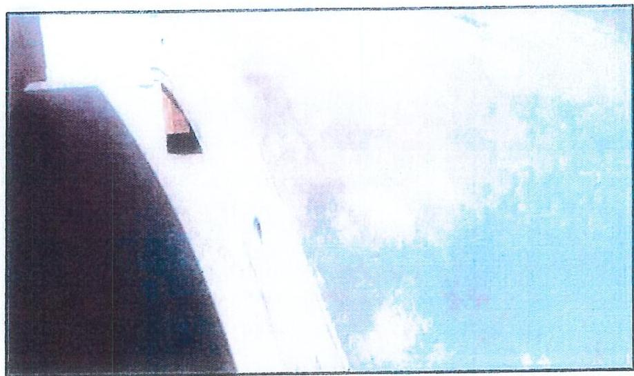

รูปที่ 12 แสดงผิวคอนกรีตหลังการซ่อมแซม

Document No.
RP-TN-02
Release/Amendment
Issue 2
Date : 20/6/2017
Page No.
8 of 8
23

<!-- Page 28 -->
VITAMIN
บริษัท วิธีแวดล้อม เลือกอิเล็กทรอนิกส์ คอมพิวเตอร์
Sony-TiSa Pneuvermics &amp; Coordination Team, CompuHertford
RP-TN-03

# SPALLING EDGE REPAIR

PROJECT : SEWERAGE TUNNEL BUNG NONG BON TO CHAOPHRAYA RIVER

24

<!-- Page 29 -->
LYDRO

บริษัท พิธา-โภว เอ็นจิเนียริ่ง แอปตี้ ทอทอ.จ.รักสั่น จำกัด (จบการ)

5000-1144 ENGINEERING &amp; CONSTRUCTION PUBLIC COMPANY LIMITED

Project : SEWERAGE TUNNEL BUNG NONG BON

TO CHAOPHRAYA RIVER

# RP-TN-03 (Spalling Repair With Cementitious Mortar)

ขึ้นงานที่แตกปั่นที่สามารถซ่อมแซมได้ขนาดของความเสียหายจะต้องไม่เกินที่กำหนดไว้ใน TB-RP-01 (Guideline For Repair)

ในส่วนของวัสดุที่ใช้ซ่อมแซมนั้นจะต้องใช้มอร์ดาร์ที่มีกำลังอัดสูงกว่า 400 ksc และมีการหดตัวน้อย รวมทั้งต้องใช้น้ำยาประสานคอนกรีตในการซ่อมแซม

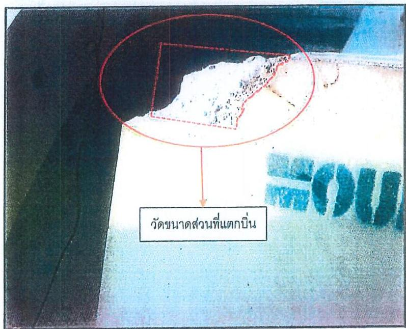

รูปที่ 1 แสดงขนาดรอยปั่นแตก

## 1. อุปกรณ์ที่ใช้ในการซ่อมแซม

1.1 เครื่องเป่าลม
1.2 เกรียง
1.3 ฟองน้ำหรือลูกกลิ้ง
1.4 กระดาษทรายหรือเครื่องขัดผิวคอนกรีต
1.5 ภาชนะใส่วัสดุซ่อม
1.6 เครื่องตัดและใบตัดคอนกรีต

[tbl-16.html](tables/tbl-16.html.html)

<!-- Page 30 -->
26

หน้าที่ 96 หน้า 100 เสียเงินสร้าง และค่าตอบแทนที่จะ จำกัด (สหกรณ์)
2017-2018 2018-2019 2018-2019 2018-2019
Project : SEWERAGE TUNNEL BUNG NONG BON
TO CHAOPHRAYA RIVER

## 2. วัสดุที่ใช้ในการซ่อมแซม

### 2.1 วัสดุเชื่อมประสานคอนกรีตที่เสนอขออนุมัติใช้ดังนี้

-Sikadur 32 TH ผสมด้วยอัตราส่วน A:B = 2:1 โดยน้ำหนัก

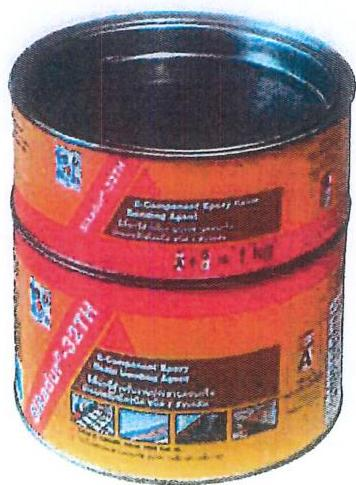

รูปที่ 2 แสดงวัสดุเชื่อมประสานคอนกรีตที่ใช้ในการซ่อมแซม

### 2.2 อิพอกซึมอรัดไฟฟ้าสนอขออนุมัติใช้ดังนี้

[tbl-17.html](tables/tbl-17.html.html)
[tbl-18.html](tables/tbl-18.html.html)

<!-- Page 31 -->
TUNNEL

บริษัท ซีบา โดย เล็บจีบีนวั่ง แผนที่ พนมมะวัตถุใด จำกัด (ทบ.ทด)

SOFT THEATRE INSTRUMENTS CONSERVATIVE TO THE POWER COMPANY LIMITED

Project : SEWERAGE TUNNEL BUNG NONG BON

TO CHAOPHRAYA RIVER

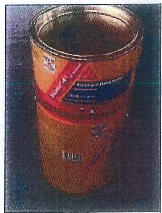

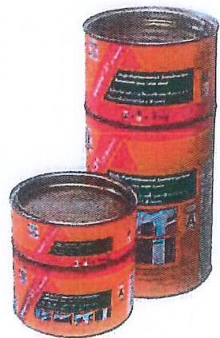

รูปที่ 3 แสดงวัสดุที่ใช้ในการซ่อมรอยแตกบิ่น

## 2.3 ปูนฉาบซ่อมที่ใช้ในโครงการ

[tbl-19.html](tables/tbl-19.html.html)

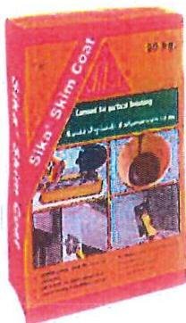

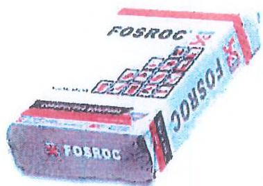

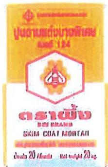

Document No.
RP-TN-03

Release/Amendment
Issue 2 Date : 20/6/2017

Page No.
3 of 7

27